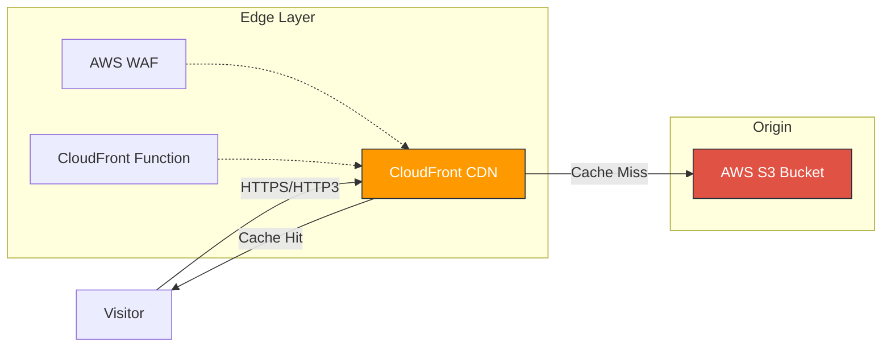

# Authentic Nerd - Personal Blog

Welcome to the source code for [AuthenticNerd.com](https://authenticnerd.com). 

This project is a high-performance, static personal website built to explore the intersection of technology, systems 
thinking, and authentic living. It has been migrated from a legacy WordPress installation to a modern, serverless 
architecture designed for minimal cost, maximum security, and "Zero JS" performance.

## 🚀 Tech Stack

### Frontend
* **[Astro 5](https://astro.build/):** The core framework. Used for its "Zero JS by default" philosophy and 
  "Islands Architecture."
* **[Preact](https://preactjs.com/):** A lightweight (3kB) alternative to React. Used for interactive components where 
  necessary, keeping the bundle size microscopic.
* **[TypeScript](https://www.typescriptlang.org/):** Type-safe development for reliability and maintainability.
* **[Sharp](https://sharp.pixelplumbing.com/):** High-performance image processing. Used by Astro to automatically 
  optimize and convert images to WebP at build time.
* **Scoped CSS:** Styling is handled via Astro's built-in scoped CSS, avoiding the overhead of heavy CSS frameworks.

### Infrastructure (AWS Serverless)
* **AWS S3:** Object storage for hosting the static HTML/CSS/JS assets.
* **AWS CloudFront:** Global Content Delivery Network (CDN) for caching and edge delivery.
* **AWS Route53:** DNS management.
* **AWS Certificate Manager (ACM):** Free SSL/TLS certificates.
* **AWS WAF:** Web Application Firewall for security at the edge.
* **Terraform:** The entire infrastructure is defined as code (IaC), allowing for reproducible and version-controlled 
  environments.

---

## 🏗 Architecture

The site uses a "Static Site Generation" (SSG) architecture. There is no server running Node.js or PHP at runtime. 
Instead, Astro builds the entire site into static HTML files at build time, which are then distributed globally.



### Key Architectural Decisions

1. **CloudFront Functions:** A lightweight JavaScript function runs at the edge to rewrite "pretty URLs" 
  (e.g., `/about/`) to the actual file path (`/about/index.html`), ensuring clean routing without server-side logic.
2. **Origin Access Control (OAC):** The S3 bucket is **private**. Direct public access is blocked. Only CloudFront is 
  authorized to read files via a secure signature, preventing bandwidth theft and bypassing the CDN.
3. **Brotli & HTTP/3:** The distribution is configured for modern compression (Brotli) and the QUIC protocol (HTTP/3) 
  to minimize latency.

---

## 📂 Project Structure

```text
.
├── blog/                  # The Astro application source code
│   ├── src/
│   │   ├── components/    # Reusable UI components (Preact/Astro)
│   │   ├── layouts/       # Page shells (BaseLayout, MarkdownPostLayout)
│   │   ├── pages/         # Route definitions and Markdown content
│   │   └── styles/        # Global CSS
│   └── astro.config.mjs   # Astro configuration
│   └── deploy.sh          # Configures env vars and runs deploy_blog.sh
│   └── deploy_blog.sh     # Build website and sync with S3
│
├── terraform/             # Infrastructure as Code
│   ├── blog.tf            # S3, CloudFront, and WAF resources
│   ├── dns.tf             # Route53 zones and records
│   ├── acm.tf             # SSL Certificates
│   └── main.tf            # Provider configuration
│
└── deploy.sh              # Builds and deploys my-personal-system

```

---

## ♻️ Deployment Strategy

The deployment process (defined in `deploy.sh`) uses a **"Two-Pass Sync"** strategy to optimize browser caching:

1. **Build:** Astro compiles the source into a static `dist/` folder.
2. **Pass 1 (Assets):** Images, CSS, and hashed JavaScript files are uploaded to S3 with a **1-year cache policy** 
  (`max-age=31536000`). Because Astro hashes filenames (e.g., `client.a1b2.js`), these files are immutable and can be 
  cached aggressively.
3. **Pass 2 (HTML):** HTML files (`index.html`, blog posts) are uploaded with a **0-second cache policy** 
  (`max-age=0, must-revalidate`). This forces the browser to check CloudFront for updates on every visit, ensuring 
  users always see the latest content immediately.
4. **Invalidation:** The CloudFront cache is explicitly cleared to remove any stale HTML.

---

## 📈 SEO & Optimization

* **Performance-First Design:** Assets are pre-compressed and served via edge caching.
* **Canonical URLs:** Automatically generated to prevent duplicate content issues.
* **Sitemap:** Automatically generated at build time via `@astrojs/sitemap`.
* **Semantic HTML:** Output is standard, accessible HTML that is easily parsed by search engines.

Tools Used

* [PageSpeed](pagespeed.web.dev): Web base Lighthouse test
* [WebPageTest](https://www.webpagetest.org/): Deeper website performance testing tool
  * [WebPageTest GitHub Repo](https://github.com/catchpoint/WebPageTest)
* [Security Headers](https://securityheaders.com/) Scans response headers for vulnerabilities
* Chrome Developers Tools
  * Lighthouse

---

## 👤 Author

**Jerome Terry** *Lead Software Developer | Systems Architect | Authentic Nerd*

I build systems that work, and I write about the journey of living authentically in a digital world.

[Visit the Blog](https://authenticnerd.com)
