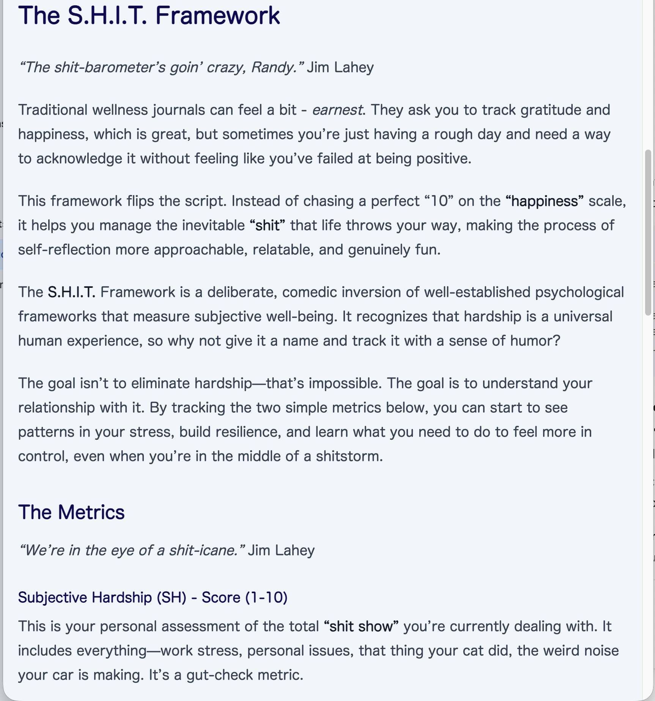

## Font Issues

As I mentioned in the [Hello, Astro!](/posts/hello-astro/) post, the font on my blog posts wasn't working for me. The
font lacked definition, especially between headings and normal text. I looked at the fonts used on a couple of websites
includding the Netflix Enginnering Blog, as well as Medium. Both of the pages I looked at used this css:

```css
font-family:
  source-serif-pro, Georgia, Cambria, "Times New Roman", Times, serif;
```

### Site Font

All pages on my blog extend [BaseLayout.astro](https://github.com/jerometerry/authenticnerd/blob/main/blog/src/layouts/BaseLayout.astro).
Here's the HTML skeleton for all pages on my blog.

```html
<html lang="en" class="scroll-smooth">
  <body
    class="bg-gray-light text-navy dark:bg-navy mx-auto w-full max-w-[80ch] p-4 font-sans leading-normal dark:text-white"
  >
    <header />

    <main>
      <slot />
    </main>

    <footer />
  </body>
</html>
```

The font classes that I setup initially were "font-sans leading-normal". I'm not a font expert, and used AI to
generate the TawilwindCSS classes. It was good enough when initially setting things up, but when I was reading my
rendered content, this font choice was bothersome.

I was using font-sans with this TailwindCSS theme setting

```css
--font-sans:
  ui-rounded, "Hiragino Maru Gothic ProN", system-ui, -apple-system,
  BlinkMacSystemFont, "Segoe UI", Roboto, Helvetica, Arial, sans-serif,
  "Apple Color Emoji", "Segoe UI Emoji", "Segoe UI Symbol";
```

### Sans vs Serif

Switching from sans-serif to serif font-family made a huge improvement, in my opinion. I switched
"font-sans leading-normal" to "font-serif leading-relaxed"

**Before**

```html
<body
  class="bg-gray-light text-navy dark:bg-navy mx-auto w-full max-w-[80ch] p-4 font-sans leading-normal dark:text-white"
></body>
```

**After**

```html
<body
  class="bg-gray-light text-navy dark:bg-navy mx-auto w-full max-w-[80ch] p-4 font-serif leading-relaxed dark:text-white"
></body>
```

I removed the TailwindCSS "--font-sans" theme configuration from [global.css](https://github.com/jerometerry/authenticnerd/blob/main/blog/src/styles/global.css),
since it was no longer used. I'm using the default "font-serif" TailwindCSS configuration. The defaults look good to me.

### Leading Relaxed on Posts

The line height on my blog posts was still a little too much. After experimentation, I discovered that chaging between
"leading-normal" and "leading-relaxed" was not changing the line-height on my posts, like it was supposed to.

I did a little digging, and it turns out that by becuase I was using "prose-lg" on my markdown rendering, the
line-height from "prose-lg" was overriding the site line-height. Posts are written in markdown files, and are rendered
using [MarkdownPostLayout.astro](https://github.com/jerometerry/authenticnerd/blob/main/blog/src/layouts/MarkdownPostLayout.astro).

The solution was to add the css class "prose-p:leading-relaxed" in "MarkdownPostLayout.astro"

**Before**

```html
<div
  class="prose prose-lg prose-code-clean prose-headings:text-navy prose-a:text-[#00539F] [&_a:hover]:text-peach prose-img:rounded-xl dark:prose-invert dark:prose-headings:text-white dark:prose-a:text-blue-300 dark:[&_a:hover]:text-peach mb-10 max-w-none"
></div>
```

**After**

```html
<div
  class="prose prose-lg prose-p:leading-relaxed prose-code-clean prose-headings:text-navy prose-a:text-[#00539F] [&_a:hover]:text-peach prose-img:rounded-xl dark:prose-invert dark:prose-headings:text-white dark:prose-a:text-blue-300 dark:[&_a:hover]:text-peach mb-10 max-w-none"
></div>
```

### Before / After Font

The serif font chagnes look much better to me. Here's the same [post](/posts/subjective-hardship-internal-tolerance)
redered with the previous and current font settings.

**Before**


**After**

