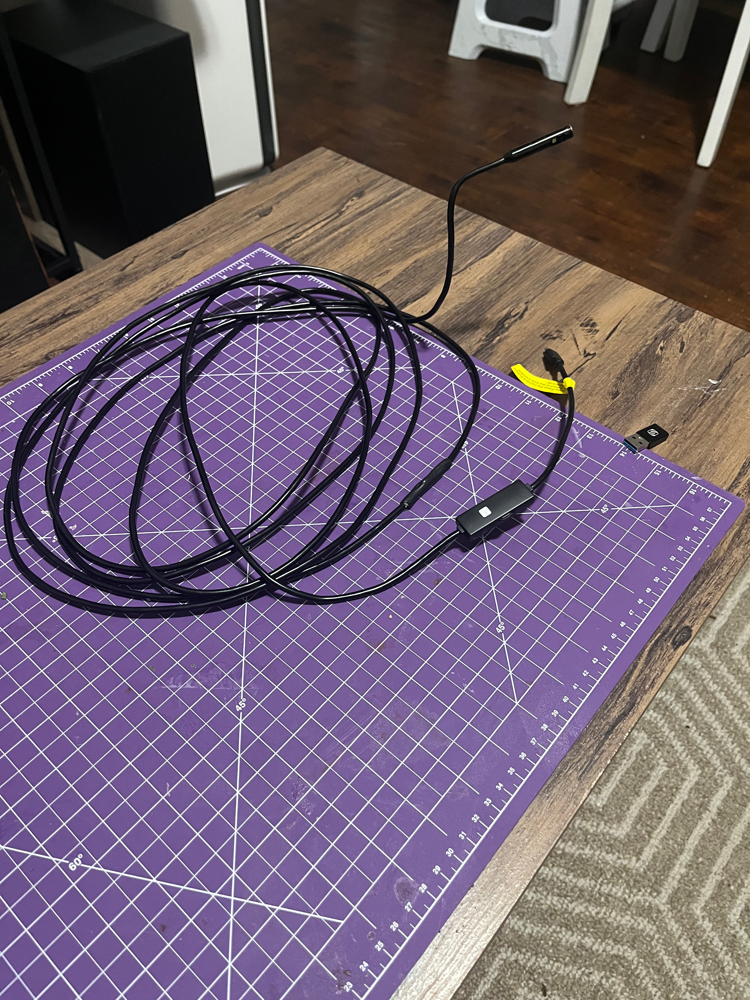

## A Simple Problem and a Cheap Camera

I ran into rotating assembly clearance issues during my [NifeliZ L6 Model Engine](/posts/nifeliz-l6) build.
To get a good look at the clearance issues, I ordered the [Kinpthy Endoscope Camera](https://www.amazon.ca/dp/B0C9JR3N4W)
from Amazon for $50 CAD. The endoscope worked pretty well, for the price. Below is a picture of the
endoscope along with a sample video to see the quality.

---

---

  <iframe
    class="w-full h-full"
    src="https://www.youtube-nocookie.com/embed/9t56tPym-fY"
    title="NifeliZ L6 Engine Short"
    frameborder="0"
    allow="accelerometer; autoplay; clipboard-write; encrypted-media; gyroscope; picture-in-picture; web-share"
    referrerpolicy="strict-origin-when-cross-origin"
    allowfullscreen>
  </iframe>

---

## Curiosity Killed the Cat

I got curious about whether the endoscope would work as a webcam on my Mac. I tried plugging the endoscope into my Mac and my Raspberry Pi. I tried using the borescope as a webcam, but neither my Mac nor my Raspberry Pi could stream video from it.

Then I googled how to get this borescope working on a Mac or Raspberry Pi. Video 4 Linux seemed like the most viable option; however, I could not get Video 4 Linux to work with the camera either.

Then I googled how to make the borescope work with Video 4 Linux. That led me to the GitHub projects [Endoscope Camera](https://github.com/jmz3/EndoscopeCamera) by [jmz3](https://github.com/jmz3) and
[Geek szitman supercamera](https://github.com/hbens/geek-szitman-supercamera) by [hbens](https://github.com/hbens). The "Endoscope Camera" project is a video streamer for the
endoscope, based on the work of hbens in the "Geek szitman supercamera" project. The "Geek szitman supercamera" contains a proof of concept OpenCV application that decodes the custom
Useeplus protocol stream from the endoscope using LibUSB

## Prototyping to Refactoring Rabbit Hole

I wanted to see if I could get a prototype working on my Raspberry Pi. I cloned both repos, then started building my own project based on [geek-szitman-supercamera/supercamera_poc.cpp](https://github.com/hbens/geek-szitman-supercamera/blob/master/supercamera_poc.cpp).

Setting up the build tools and installing the dependencies took a bit of doing, but I managed to get my own working prototype. Then my software refactoring instincts (aka OCD) kicked in, and I started reworking the code.

That refactoring exercise was the start of a 2 month deep dive into C++ programming, LibUSB, Video4Linux, and Linux Kernel Development. While hbens had done the foundational work of reverse-engineering the base protocol, I dove into expanding it—figuring out how to command the camera into higher resolutions (like 1280x960), handling protocol quirks, and wrestling with CMake, Make, Clang, and Zig. This project consumed me for those 2 months. I barely slept.

I used Google Gemini Pro 3.1 / Extended Thinking to help me navigate the kernel-level APIs. I architected the project myself, but I relied heavily on AI to build the Video4Linux (V4L2) driver, implement VideoBuffer2 (VB2) memory management, and automate the Makefiles. I polished the code until it passed checkpatch.pl, `clang-tidy`, `IWYU`, and `cppcheck` were clean, and all v4l2-compliance tests passed. I published this work under an MIT license on my personal [GitHub account](https://github.com/jerometerry) in the [useeplus](https://github.com/jerometerry/useeplus) repository.

## Patch Anxiety

The AI kept pushing me to create the official patch, telling me it was ready for review. I have to disagree, Gemini.

I've never done any Linux Kernel development before, so building a V4L2 driver was a steep learning curve. I relied on AI substantially to navigate the specifics of the V4L2 and VB2 subsystems. Because I leaned on AI to bridge my knowledge gap in V4L2, I don't feel comfortable that I know the kernel-side API deeply enough to submit this driver as an official patch.

I considered creating a patch, but decided against it. I don't want to take on the responsibility of maintaining an official Linux driver. Working with long time Linux Kernel developers who have to thoroughly review my patch made me feel uncomfortable after having done a V4L2 crash course in 2 months. I blindly accepted some of the AI's V4L2 recommendations just to make the `v4l2-compliance` and `checkpatch.pl` tests pass, but passing tests isn't the same as understanding the kernel-level implications. I would need to be able to answer reviewers' questions with confidence before I ever consider putting forward a patch, and I don't want to rely on AI to answer them for me.

The code might be ready, but I'm not. The thought of putting this work forward for review made me very nervous and anxious. At first I thought it was my insecurities of being judged by Linux kernel developers for how crappy my code was. That was just the story I was telling myself.

What I believe now is that my body was telling me I wasn't ready, that this kernel-level code was mostly AI's doing, and I can't stand behind it because I don't know it well enough at a deep, fundamental level. I was letting my ego pump itself up for having pushed through over 2 months to build a prototype, while getting carried away thinking that 2 months of experience somehow made me an expert.

I was simultaneously insecure about my work and overconfident in my expertise. I was envisioning the Linux Maintainers as overly picky, brutal reviewers as a way of avoiding what my body was trying to tell me. I used AI to build a prototype. It was fun. The code is done to the best of my abilities. Yet that isn't enough. If I had put forward a patch, I would have been a nervous wreck, but I would have been misattributing my nervousness as a fear of the reviewers criticism, instead of to my inner struggle to try and prove myself and get validation by having my code merged into the Linux Kernel.

## Authenticity

It would not be authentic for me to put my work forward with my current level of knowledge. The code may or may not be up to the standards of the Linux Kernel. That isn't the point.

While I can speak confidently about the overarching C++ architecture and how my code expands on hbens's protocol decoding, I cannot definitively defend the nuanced design choices within the V4L2 and VB2 implementations. If a maintainer asked _why_ a specific buffer allocation method was chosen, my honest answer would be "because the AI said it would pass the compliance test." That is not an acceptable answer on the Linux Kernel Mailing List.

By keeping it on GitHub under an MIT license rather than forcing a kernel patch, I'm hoping to pass the baton. It’s out there for someone who does have the deep foundational expertise—and the desire—to take this prototype and publish an official Video4Linux2 driver for Useeplus cameras.
