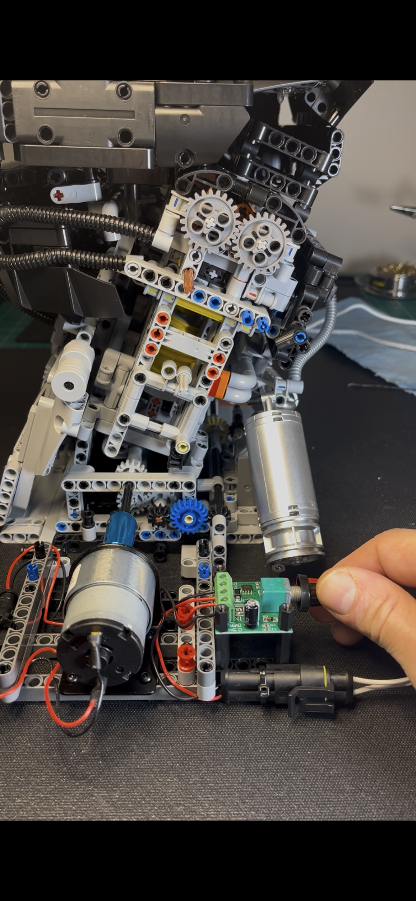
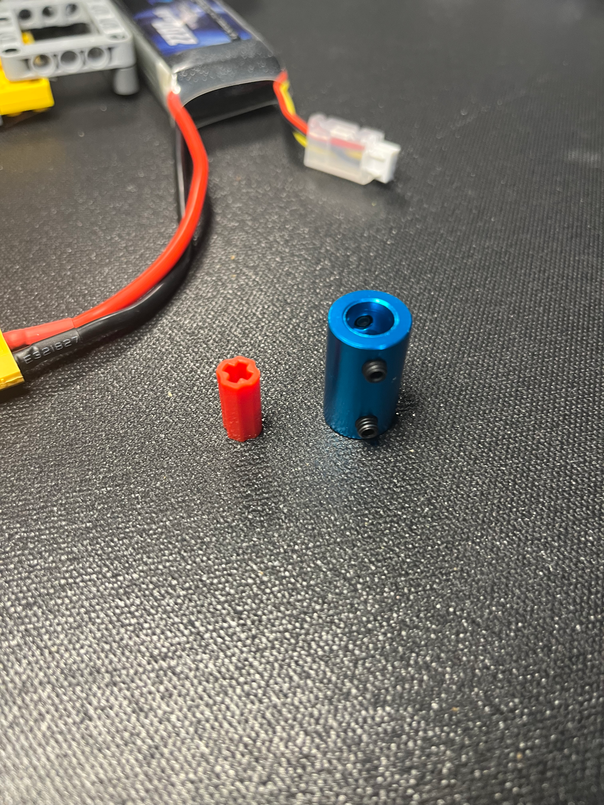
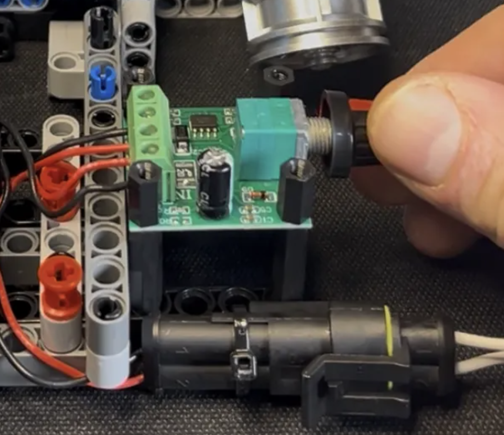
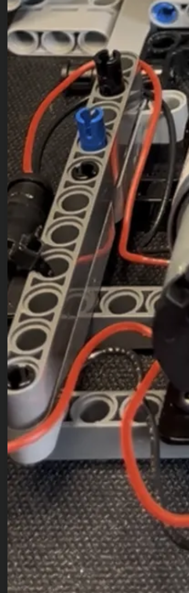
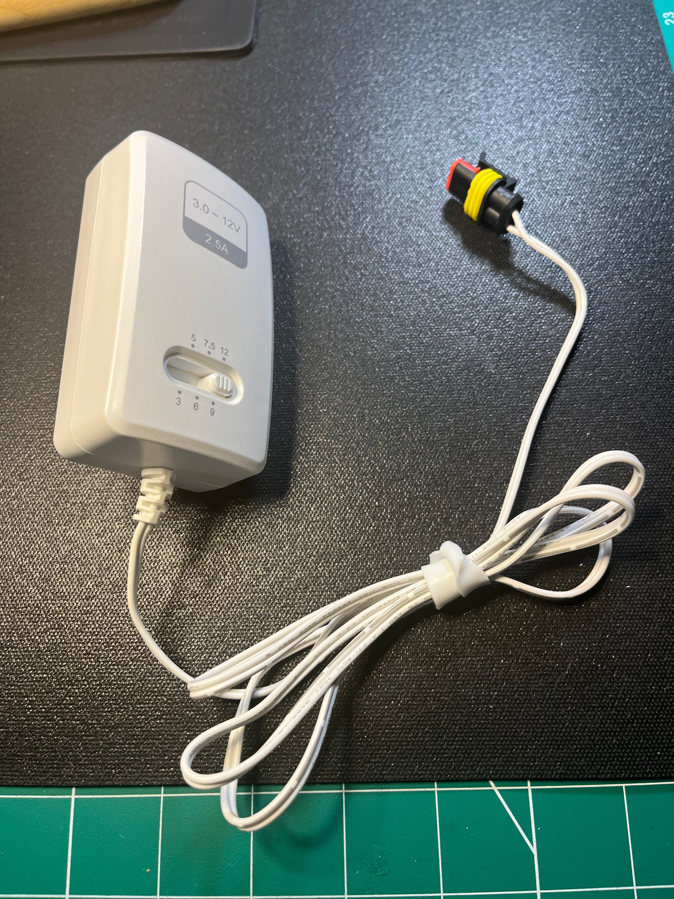

In this post, I upgrade my [NifeliZ L6 Model Engine](/posts/nifeliz-l6) build from 6V to 12V to make the NifeliZ L6
turn over smoothly at low RPMs.

## In Action

Here's the finished product: the NifeliZ L6 Model Engine powered with a 12V DC Motor. I'm very happy with how smoothly
the 12V motor handles the NifeliZ L6. The 6V motor didn't have enough torque at slow speeds to turn the motor where I
felt comfortable that the plastic rotating assembly would hold up. I was considering making this remote controlled,
and I got lost in the DIY electronics world as a newbie in Raspberry PI / Arduino GPIO. I think the speed controller
with a physical knob suits this project much better.

  <iframe 
    class="w-full h-full"
    src="https://www.youtube-nocookie.com/embed/TTGnYib35pw" 
    title="NifeliZ L6 Engine Short" 
    frameborder="0" 
    allow="accelerometer; autoplay; clipboard-write; encrypted-media; gyroscope; picture-in-picture; web-share" 
    referrerpolicy="strict-origin-when-cross-origin"
    allowfullscreen>
  </iframe>

## NifeliZ L6 Model Engine Kit

I purchased the NifeliZ L6 Engine kit on [Amazon](https://www.amazon.ca/dp/B0FHDLBM55) for $140 CAD ($100 USD).
If you're interested in the kit, check out the NifeliZ
[L6 Engine Website](https://www.nifeliz.com/nifeliz_product_l6-engine/) and the YouTube
[Promo Video](https://www.youtube.com/watch?v=ySQPRgM7hbM).

## Parts List

[JGB37-520, 12V DC Motor, 319RPM](https://www.amazon.ca/dp/B0FRWTZQMW): $26.99 CAD

Here's the 12V DC motor attached to the NifeliZ L6 model engine. I used some M2 machine screws and washers to attach
the motor bracket to the technic beams. Those small screws have enough play in the 4.7mm technic beam holes to align
the DC motor to the NifeliZ engine. The centerline of the DC motor wasn't too far away from the crank centerline. A
single technic beam was almost high enough to bring it perfectly in line - I used an M2 nut as a spacer between the
Technic beam and the motor bracket on each of the 4 mounting screws. I'm really happy with how sturdy this was.

[Anodized Aluminum 6mm to 8mm Bore Coupler](https://www.amazon.ca/dp/B07P6XB2MJ): $13.99 (pack of 2)

To couple the DC motor to the NifeliZ L6 crank, I used a 6mm to 8mm aluminum coupler which has 4 set screws to lock
onto the DC motor shaft and the NifeliZ L6 crank. The 6mm end attaches to the 6mm DC motor output shaft. The 8mm end is
attached to a technic axle connector, which happens to fit quite nicely. The blue anodized aluminum coupler adds a nice
color contrast.

[1803BK PWM Motor Speed Controller](https://www.amazon.ca/dp/B09Q8BHWHM): $13.99 CAD (pack of 6)

The 1803BK PWM Motor Speed Controller is simple and effective. The 12V DC motor doesn't really start moving the NifeliZ
L6 engine until about 50% of the range. Once the motor starts turning, the 1803BK PWM speed controller sweeps through
the RPM range smoothly.

[Solid Core Hook-up wire kit (6 rolls) 22 AWG](https://www.amazon.ca/Coated-Colors-Spools-Tinned-Fermerry/dp/B09BFFJRST): $25.30

Solid core wire isn't essential, any wire will do. I had been using this 22 AWG solid core wire for beginner
electronics breadboarding with Arduino, and it's really good for keeping things neat and tidy. It stays where you put
it which is nice when you need to keep away from the output shaft.

[RCA PAD2500WZ](https://www.canadiantire.ca/en/pdp/rca-ac-to-dc-universal-power-adaptor-white-2500-ma-0452882p.html): $44.99 CAD

I was using 7.4V 2S LiPo batteries to power the 6V DC Motor, as an upgrade to the Technic XL motor. I was trying to
keep it wireless, and mirroring the Lego motor setups. For the 12V DC motor, I didn't want to purchase 12V LiPo
batteries, so I purchased a 12V power supply. I happened to find the RCA PAD2500WZ in a local hardware store, and was
surprised to see that it had several different voltage outputs. I liked it because I am switching between projects
that have different voltage requirements, and this RCA power adapter is perfect for my use case.

I cut the barrel end off and replaced it with an automotive quick disconnect connector instead. I want to be able to
swap out components and mix and match, so the automotive 2 wire quick disconnect makes sense. It's also safer, since
there's no exposed barrel plug.

Here's the remaining items I purchased that went into this setup.

- [Metric Machine Screws, Nuts and Washers Kit, 1705 pieces](https://www.amazon.ca/dp/B0C3926M1B): $28.99
- [2 Pin Connector Automotive Waterproof Connectors](https://www.amazon.ca/dp/B0FM8KT2ZZ): $23.99 (kit, 25 count)
- [SN-68B Crimping Tool Connector Kit](https://www.amazon.ca/dp/B0FD9KGK4G): $45.99
