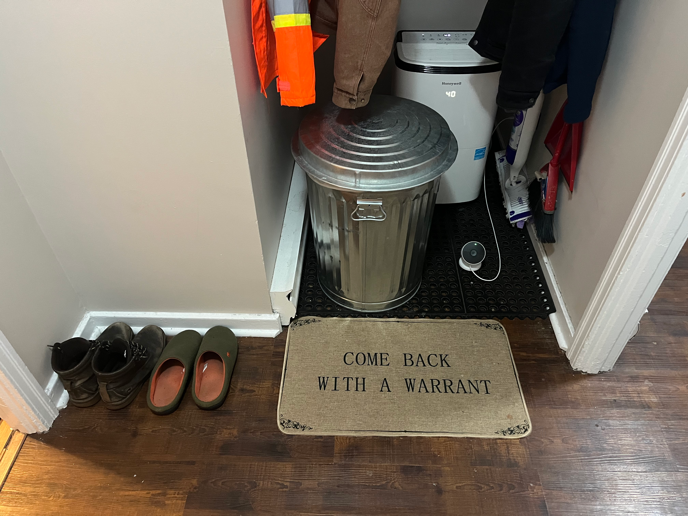

I've debated whether or not to write this post, but something keeps pulling me toward releasing it—so here goes.

## Previous Behaviour

At the beginning of July, I wasn't responding to anyone's texts or calls, not even my dad's. Since he isn't exactly one to let things go, he called me three days in a row; when I ignored those, rather than taking the hint, he showed up knocking on my door at 8:30 AM on a Monday morning. I thought I was dreaming as I answered the door barely awake. He opened by explaining he’d been trying to reach me for days and claimed that he and Mom were worried about me. This is highly ironic given they can easily go months without calling, yet the moment I don't answer for three days, they're suddenly at my doorstep. I was highly skeptical of his motives, but I heard him out anyway.

He let me know that my three-day silence had worried Mom and suggested I "touch base" to "ease her mind"—which is rich, considering that whenever I'm at their house and say something she dislikes, she quickly asks if I'm "gone yet." Finally, he got to the actual reason he was trying to reach me: he wanted my help with something he'd been thinking about. While it was clearly important to him, it was absolutely nothing he couldn't have just texted me. I gave him some advice, agreed to help, and as he left, his parting words were a casual "don't be a stranger," or something to that effect.

After he left, the anger really set in. He claimed he woke me up out of worry, but the reality was simply that I hadn't answered him on his timeline. I couldn't help but imagine knocking on his door while he was in bed, picturing the absolute earful I'd get if I showed up just to ask a trivial question. He’s incredibly vocal about setting his own boundaries, quick to say no, and never shy about expressing his disapproval, yet here he was doing something he would ruthlessly chastise anyone else for—all conveniently disguised as "Mom's worry."

## July 23rd - Dad's Invitation Text

In my last post [Intent, Impact, and Emotional Blackmail](https://www.google.com/search?q=/posts/intent-vs-impact), I analyzed the following text message from Dad through three different frameworks (FOG, FATE, & Modes of Persuasion):

> Happy 50th Anniversary to us. Lol
> Your mother had her stent done yesterday and had a rough time.
> She has her chemo tomorrow .
> What she is hoping if you are free Saturday afternoon and want to drop by, we'll buy the Chicken.

When my dad sent me this text on July 23, 2026, I was initially overcome with anger because it wasn't the first time he had weaponized my mom's health to get me to do what he wants. That’s exactly why the anniversary text pissed me off so much: he was trying to guarantee my attendance at what should be a joyous occasion by tying it to her medical struggles. The emotional whiplash of his message, combined with the fact that he had used a similar tactic just weeks prior, deeply unsettled me.

I believe my reaction to this message is what ultimately sent him over the edge. While my parents' 50th anniversary is undeniably a milestone event, I don't take my own mental health and right to privacy lightly. I've always been a little intimidated by my dad, but I knew I needed to address his sense of entitlement. If we had a healthy relationship, I would have handled this the healthy way: calling out his behavior, stating my boundaries, and asking him to respect them. However, I didn't do that. Instead, I doubled down on my rebellion.

Since he clearly didn't get the message the last time I went silent, I figured wishing them a belated happy 50th anniversary would just have to be good enough. I was simply unavailable that day—maybe I needed to rearrange my sock drawer, or whatever. The point is, the reason for my absence shouldn't matter, and I shouldn't have to explain myself when I'm almost 50 years old, for fuck's sake. So, I ignored his text, and that’s when the trouble really started.

A couple of hours after my dad's text, my brother called. Suspecting that my dad was rounding up the troops, I ignored it, and I ignored the second call that immediately followed.

Anticipating some impending family shenanigans, I emailed my therapist to squeeze me in so I could process everything without completely losing my shit. Thankfully, she found an opening for 8:30 PM on Friday, and let me tell you, I'm so glad I booked that session. Sticking to my guns and refusing to respond to my family during a milestone event was bound to set off fireworks, but part of me was just genuinely curious to see what my unavailability would provoke. Honestly, if my dad had simply texted, "Hey, we're having a get-together on Saturday for our 50th and we'd love for you to celebrate with us," I would have shown up without a second thought. But instead of an invitation, he approached it with the presumption that he has access to me whenever he pleases—silly me for thinking invitations were actually optional.

## July 24th - Day Before 50th Anniversary Family Get Together

Around 2 PM on Friday, July 24th, I found a note on my door from Dad containing his two phone numbers (both of which are already in my phone) and a request to call him. I tucked the note away as a "show and tell" for my therapist. When he followed up with a voicemail at 6:30 PM asking me to call, I ignored that too. With my therapy session scheduled for 8:30 PM, I wanted to work through my thoughts before engaging with my family, figuring the two hours in between would fly right by. Nope. lol. At 7:30 PM, there was a knock on my door, and sure enough, it was Dad. He clearly wasn't getting the message, and after two days of being ignored, I suspected he might be a little hot under the collar. Since I had no intention of opening the door to a potential fight, I just stayed seated on my couch sipping tea and reading my book. He knew I was home, and I could clearly hear him knocking. While I could have easily walked the fifteen feet to let him in, my session was less than an hour away, meaning my dad was just going to have to wait.

I ended up having a lovely chat with my therapist about healthy ways to establish and enforce boundaries. She reminded me that when people violate your boundaries, you don't owe them anything—including your time or your presence. Sometimes, with certain people, no response _is_ the correct response. It feels counterintuitive when society conditions us to believe that acknowledging people is just common decency. However, caving in to those who violate your boundaries only teaches them that your boundaries aren't actually real. While ignoring your dad at the front door might seem excessive from the outside, the reality is that I don't live in his house, he doesn't pay my rent, and he doesn't get unrestricted access to my home just because he feels entitled to it. If I want to shut out the world, I have every right to do so without providing a single explanation.

I mentioned to my therapist that I suspected my dad wouldn't let this go and would likely show up at my door first thing in the morning. Even though I felt horrible about the situation, I was determined to stick to my guns. My mom's health issues and my parents' 50th anniversary are genuinely important to me, but so are my mental health and privacy, and I absolutely refuse to tolerate my dad leveraging my mom's illness whenever he wants a favor. I'm only just getting comfortable with setting boundaries, and my dad, along with my patience, was already severely testing them.

At my therapist’s wonderful recommendation, I booked a room with a spa at a nice hotel and ended up having a fantastic night's sleep.

## July 25th - 50th Anniversary Family Get Together

The next morning, I slept in, finished reading my book, and grabbed breakfast at Denny's before making a trip to the bookstore. Since the anniversary gathering was scheduled for 2 PM, my plan was simply to remain unavailable, let them have their get-together, and then catch up with my parents the following day. Boy, did that plan go to shit.

The barrage started with Mom calling at 11 AM, followed by my brother calling twice at 1:30 PM, and finally, my dad knocking on my door at 2:20 PM. At that point, I just turned my phone off and ignored the door. My family was clearly refusing to take the hint, and I was refusing to back down; it had turned into an all-out battle over their access to me.

The truth is, they weren't genuinely worried about my wellbeing—they were just butthurt that I was ignoring them. While that's a fair reaction since no one likes to be ignored, it reminded me of a conversation I had with my dad recently. When I confided in him that I was just starting to realize the people I trusted most had been lying to my face my whole life, his response was a callous, "You'll have to get over that." I've lived with rose-colored glasses on for decades, and when I finally try to share my experience, his only advice is to just get over it? Like, WTF? That lifetime of trauma I'm currently unpacking in therapy—sure, I'll just get over it. I should really run that revolutionary approach by my therapist.

Later that evening at 8 PM, my sister texted to say she wasn't sure what was going on but that I could always reach out to her. While I initially thought she was being sincere, I quickly realized she was just echoing the family narrative: because I didn't show up, there must be something deeply wrong with me. Notice what _wasn't_ in her message—no "sorry we missed you, hope to catch up soon," no "everyone was hoping you'd come," and certainly no genuine "we're worried because we can't reach you." The unspoken message behind their communication was that my presence is an obligation. If I don't show up, then there is clearly something wrong with me.

I eventually checked my voicemail at 11 PM and found this lovely message from dear ol' dad:

> Jerome, I've been trying to get a hold of you and, and uh, you're not answering your door or your phone. I'm almost thinking I needs to send uh, somebody for a wellness check on you. Do I need to do that? I mean 'cause your mother is worried and she's having a rough time. Give me a call.

Whiskey Tango Foxtrot. "I'm almost thinking I needs to send uh, somebody for a wellness check on you. Do I need to do that?" If I were actually in harm's way, I would certainly hope my parents cared enough to call the authorities. But let's break down this scenario to highlight just how unhinged his text really is. Even if we give him the benefit of the doubt and attribute his voicemail to genuine concern, put yourself in his shoes: your child isn't responding, his car is in the driveway, and his lights are on, but he's not answering the door. You have to decide whether to call for a wellness check because you fear for his life, or admit that he is perfectly fine but actively ignoring you. Which is more likely? Furthermore, if you legitimately suspected your child was incapacitated, would you leave a voicemail asking _them_ if a wellness check is necessary? Of course not—you'd pick up the phone and call it in.

My dad had crossed a line my therapist explicitly warned me about by using the threat of a wellness check (let that phrase sink in) to compel my compliance. Listening to the voicemail, I could hear a trace of fear and apprehension in his voice, but it wasn't fear for my wellbeing. It was the fear that his usual manipulative tactics weren't working anymore, coupled with a bruised ego over his child blatantly ignoring him. Naturally, rather than accepting the painful truth that I was choosing not to respond, he twisted the narrative to make himself the worried father checking on my safety.

Knowing how stubborn my dad is (the apple truly doesn't fall far from the tree), I genuinely feared he might actually follow through with his threat. To nip that in the bud, I called the RNC non-emergency hotline to have a note placed on my address. I calmly explained to the officer that I was an adult doing perfectly fine, but my dad had left a voicemail threatening to request a wellness check simply because I wasn't returning his calls. While I told them they were welcome to send someone if protocol demanded it, I just wanted to prevent an unnecessary waste of police resources. It is absolutely insane that I had to preemptively call the police to block my own father from abusing emergency services. That’s the reality he likely didn't consider: sending an officer to my door for a fake emergency could mean that someone in a real crisis doesn't get help in time.

### Anticipating Wellness Check

Despite my call, I was still fully prepared for a police officer to show up at my door. If I'm being completely honest, I was actually getting excited to greet them with a polite smile, welcome them in, and ask how they liked my doormat that reads, "Come Back with a Warrant."

I don't know how often an officer conducts a wellness check only to be met with a bold "come back with a warrant" mat, but I would absolutely love to see their reaction. lol. If that didn't get at least a laugh, I'd be highly disappointed.

## July 26th - Day After 50th Anniversary Family Get Together

The relentless pursuit continued when my dad showed up at my door again at 3:30 PM on July 26th, following several unanswered calls that morning. Checking my security camera, I was genuinely alarmed to see him with his face pressed against the frosted glass of my door, using his hands to block the sun so he could peer into my apartment. While my landlord happened to be outside painting her fence at the time, I thought nothing of it until I received a text from her twenty minutes later. She informed me that my dad had approached her, explaining he’d been trying to reach me for days regarding something "important," and asked her to tell me to call him. What in the actual fuck. My dad was firmly crossing into stalking territory, but it gets worse.

## July 27th - Monday After 50th Anniversary Family Get Together

On Monday, July 27th, I was just getting ready to head to work when, at 9:20 AM, Dad was back knocking on my door. I didn't answer, completely unaware that he had parked his van in my driveway to physically block my exit and force a confrontation. Since I had his number blocked, he used a different cell phone while sitting outside my house to leave a voicemail announcing he was waiting for me. I hadn't checked my messages before walking out, so seeing his van sitting there threw me straight into fight-or-flight mode—and let me tell you, flight was not an option.

Dad rolled down his window and told me to get in, which I flatly refused, demanding instead that he step out of the vehicle. If we were going to do this, we were going to do it in public, with witnesses. To my surprise, he stepped out looking perfectly calm. It completely threw me off; how on earth do you essentially stalk someone for five days and not be furious? Though I was incredibly angry myself, I stayed reasonable, telling him that while we clearly had a problem we likely wouldn't see eye to eye on, I was willing to give him the floor. He readily agreed with me. What the hell? Who was this man, and why cause such a massive ruckus only to act so agreeable?

The answer to why he wasn't angry quickly revealed itself: he hadn't come to yell, he had come to deliver the most epic, devastating guilt trip I have ever heard in my life. The moment he started talking about "my mother" and how unwell she was, I almost blew up. I cut him off, stating clearly that I understood Mom had cancer, but that's when his guilt trip turned truly nasty.

He stopped me right there, started tapping the index fingers of both hands together, and began physically tallying up an imaginary list of all the problems my actions were causing her—above and beyond the cancer itself. Having heard enough of his bullshit, I looked at him and said, and I quote, "You're full of shit." Shockingly, he acknowledged that I was probably right. What the fuck? Yet, he plowed right ahead with his "updated" lecture on Mom's health. He wasn't there to express anger at me; he was there to explicitly state that my lack of response was actively hurting my mom and making her sicker. With the dramatic emphasis he placed on his imaginary list of grievances, he essentially left me with the impression that I am a worse affliction than her cancer.

I firmly told him that I would not be discussing Mom with him and would speak to her directly. When I pivoted to how angry I was about his manipulative text message containing her health update, he feigned ignorance, asking, "What invitation?" He fires off so many thoughtless texts that he genuinely couldn't remember what he wrote, forcing me to refresh his memory. I then confronted him about his apparent entitlement to show up at my house whenever he pleases. He nodded and boldly agreed that he absolutely felt entitled to do so, to which I replied that he was dead wrong—he does not have unrestricted access to me or my home. Undeterred, he tried to circle back to Mom's health, but I cut him off again. I told him that all I wanted was to be left alone to work through my therapy, pointing out the hypocrisy that he constantly weaponizes Mom's health but hadn't bothered to ask a single question about my wellbeing or my therapy progress. His pathetic defense was, "We don't know about therapy, how can we ask about it?" More utter bullshit. You ask by simply opening your mouth and asking. I didn't miss a beat before firing back, "You use AI for everything else." He didn't have a comeback for that one.

It was at this point that he finally started to back down, though not without landing a few more heavy blows. He dramatically declared that he would never contact me again and would inform Mom that I wanted nothing to do with them. Even though I explicitly pointed out, "That's not what I said," he ignored me, adding, "The next time you hear about your mom, it won't be from me." But the real gut punch—the one I never saw coming and never imagined my own father could deliver—happened just before he got into his van. I didn't catch the exact phrasing, but it was to the effect that I would regret my actions after Mom was dead and gone. In two sentences, he effectively told me that I would be to blame for my mother's death.

Less than three hours later, while I was still at work, my dad returned to my house one last time to drop off my lawnmower. Finding it sitting by my door when I got home felt incredibly symbolic. Without saying a word, my dad made his final point perfectly clear: he's completely done with me, and in his eyes, I'm as easily discarded as that lawnmower.
