## DIY Technic Electronics Board

I recently added a Technic beam grid to a bamboo cutting board to make the ultimate project board for DIY Technic / Electronics Projects. I used 1x2 and 1x4 beams to create a grid that allows me to easily attach and detach components using pins and connectors. The board is sturdy and provides a great surface for building and experimenting with different configurations. It's perfect for prototyping and testing out new ideas in a fun and hands-on way. Whether you're working on a robotics project, an electronics circuit, or just want to have fun building with LEGO, this board is a great addition to your toolkit.

### Laying out the Grid

My bamboo cutting board I bought at Canadian Tire was the perfect backer board for this project. It's 3/4" thick, so there's plenty of depth to create blind holes for the technic pins to fit into. I started out by laying out the grid in pencil, making sure the grid was centered and angles were perfect 90s. Grid dimensions ended up being roughly 12" x 9".

Then I grabbed all the technic beams I had and fashioned up a grid. 60/40 split along the largest side worked for me, since that left one area large enough to fit a standard 830 pin breadboard in both orientations. I then created a 60/40 split in the smaller section, which allows for things like Arduinos, breakout boards, control knobs, etc.

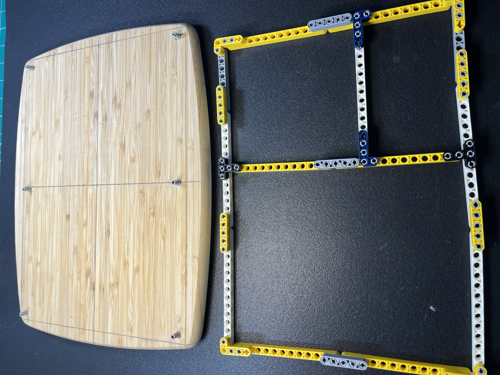

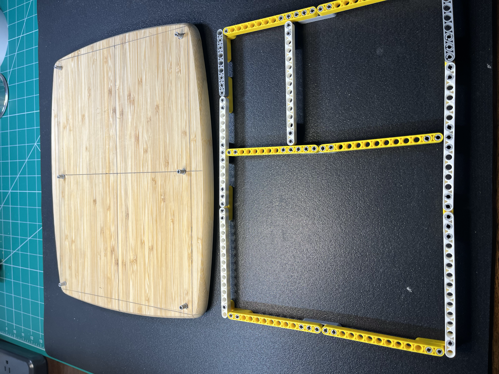

### Attaching Technic Pins

I experimented with a few different sized drill bits until I found one that the pins fit into snugly. I used the preassembled Technic beam grid and technic pins to use as a centering guide for a small pilot hole. Then drilling the larger hole was a breeze.

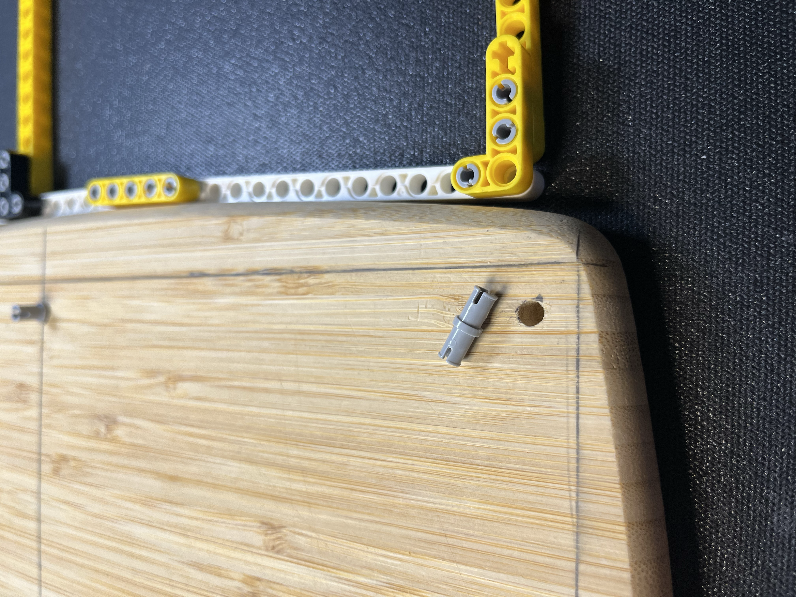

### Attaching Technic Grid

Good thing Technic beams have tolerances. Since I was using an electric drill freehand, the holes weren't perfectly placed. But they were close enough. Good enough for this project though, thankfully. It took some persuasion, but I managed to get it attached.

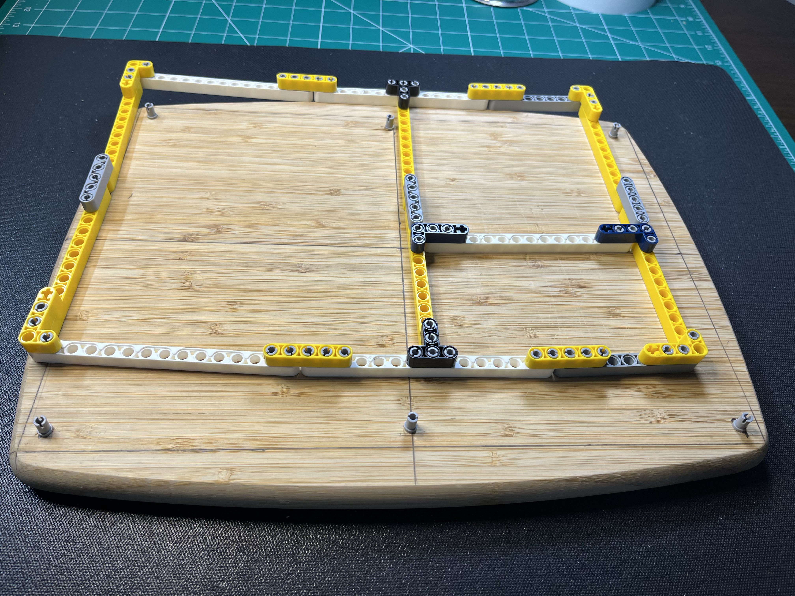

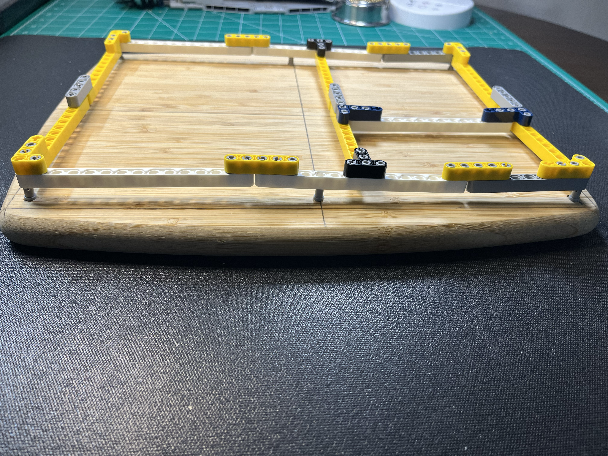

### Reveal

I was very pleased with my handy work seeing the Technic grid attached to the cutting board. I like the 60/40 splits, and the color contrasts of the white, yellow and grey Technic beams.

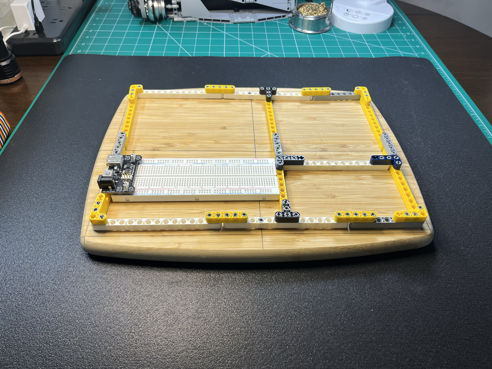

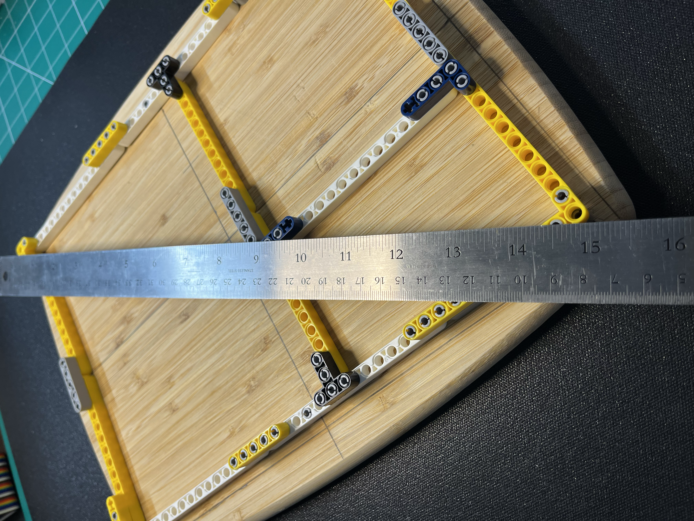

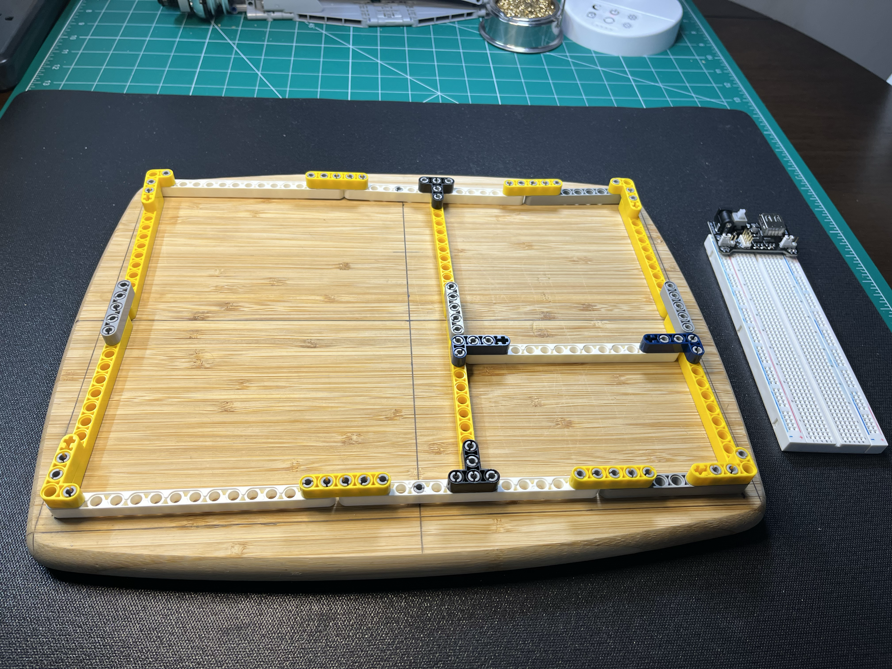

### Programming Arduino UNO R3

This was a simple use case for my Techic electronics board. I was testing out remotely programming my UNO R3 from my Raspberry PI over SSH from my Mac. My Arduino sketches are on my [GitHUb](https://github.com/jerometerry/arduino) if you're interested.

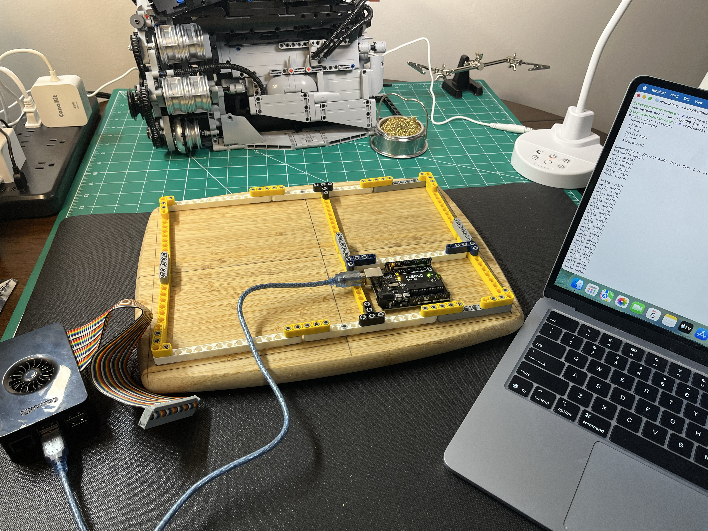

### 12V DC Motor Prototyping

I am experimenting with an [12V JGB37-520 Gear Reduction Motor](https://www.amazon.ca/dp/B0FRWTZQMW) for my [NifeliZ L6 Model Engine Project](/posts/nifeliz-l6).The Technic Electronics Board worked beautifully for my needs.

Here's a couple of pictures of an iteration using a [1803BK PWM Speed Controller](https://www.amazon.ca/dp/B09Q8BHWHM). The breadbooard isn't populated in this iteration since I had just removed the [6V DC motor](https://www.amazon.ca/dp/B0FRWZ9FD8?th=1) controlled with an [L298N H Bridge](https://www.amazon.ca/dp/B0D2RLY7GH) that was wired up using the breadboard.

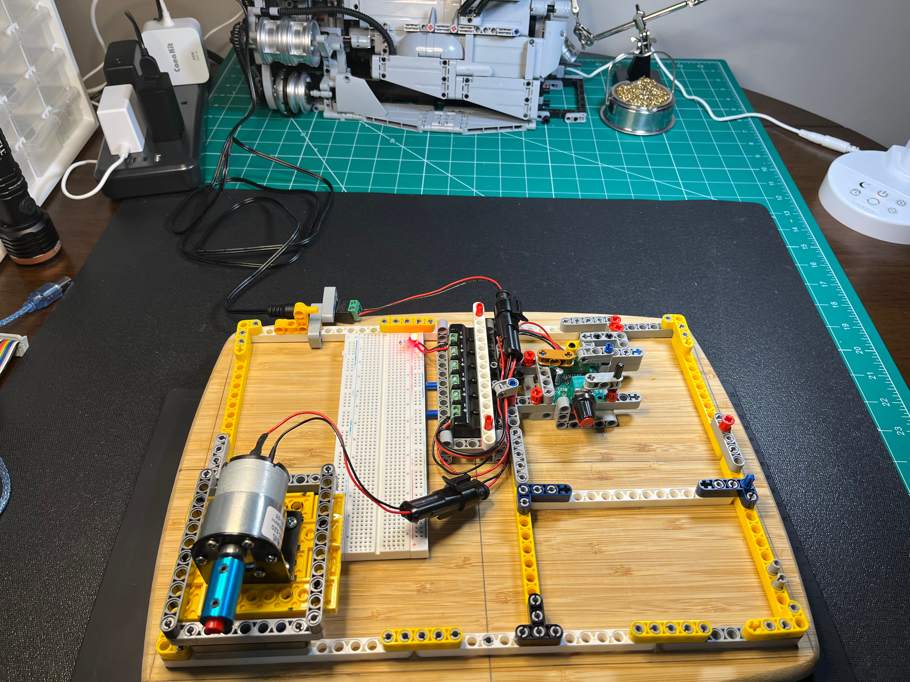

Top-down view

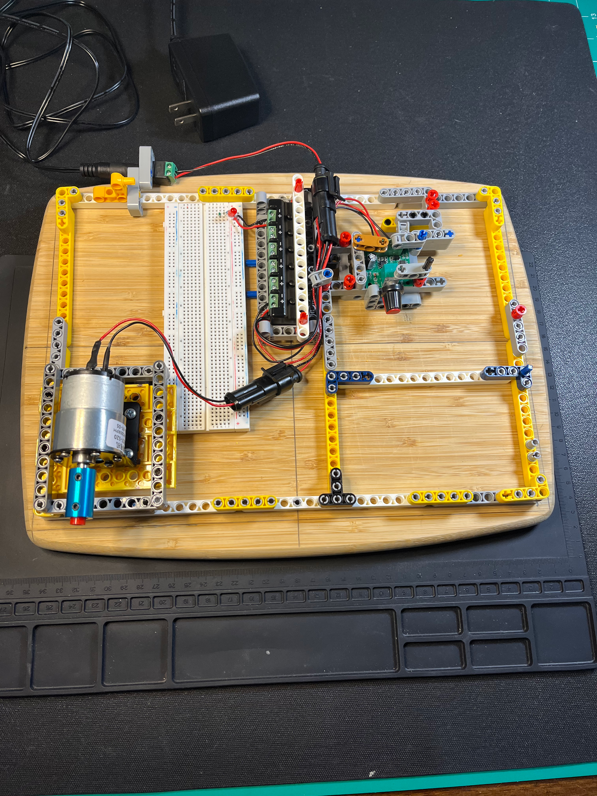

Portrait top-down view

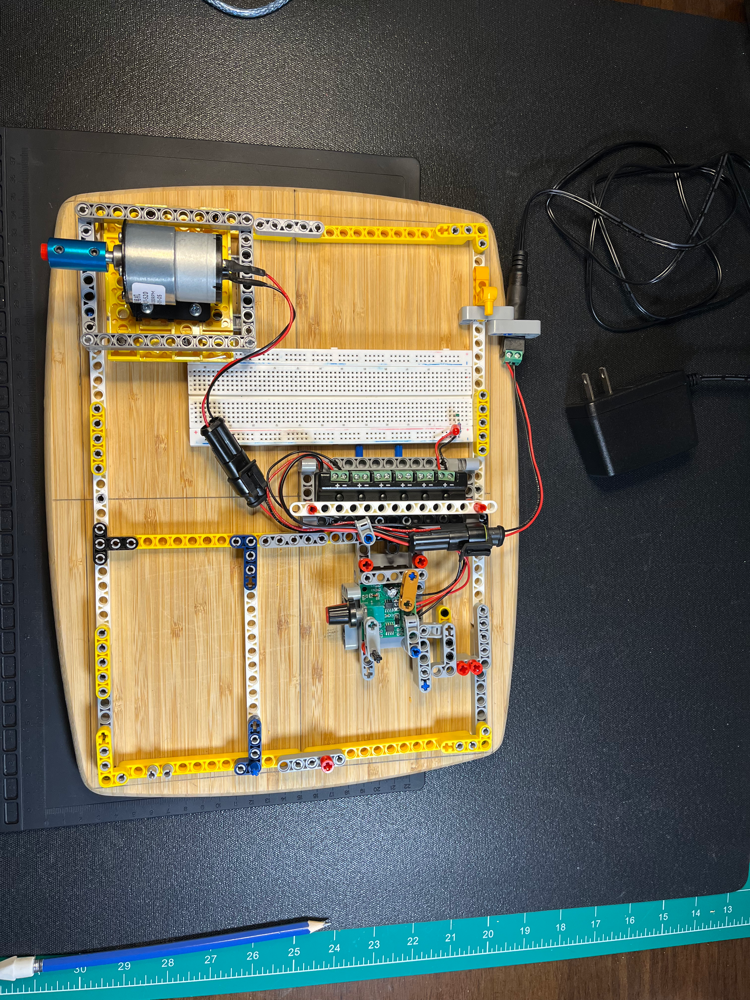

### Current Monitoring

Here's another project for the 12V DC motor that I've moved to for powering the [NifeliZ L6 Model Engine](/posts/nifeliz-l6). The 12V motor has much better torque to slower speeds to allow turning over the NifeliZ L6 smoothly at slow speeds. In this picture you can see the [I2C INA219 Current Sensor module](https://www.amazon.ca/dp/B0CG9HNZZR) connected to an UNO R3. The INA219 Current Sensor is monitoring high side current, where the Vin+ and Vout- pins are wired in series with the +12V lead from the power supply. The INA219 has a built in shunt resistor.

The 12V motor is attached to the L6 Engine, and has been disconnected from the connectors in this photo. The 12V power supply has also been disconnected. The UNO R3 is currently being powered my my Raspberry PI 5 over USB.

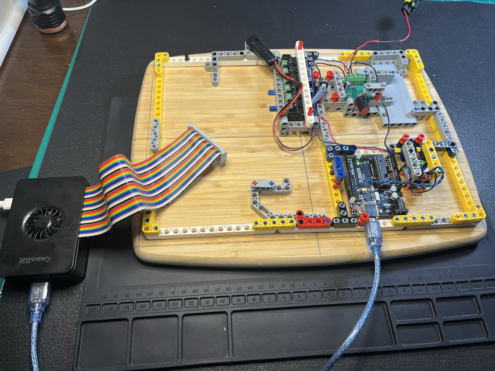

### Final Thoughts

Overall, I'm really happy with how this project turned out. The Technic Electronics Board is a great addition to my workspace and has already been put to good use in several projects. It's a fun and creative way to combine the world of LEGO Technic with electronics prototyping, and I look forward to using it for many more projects in the future.
